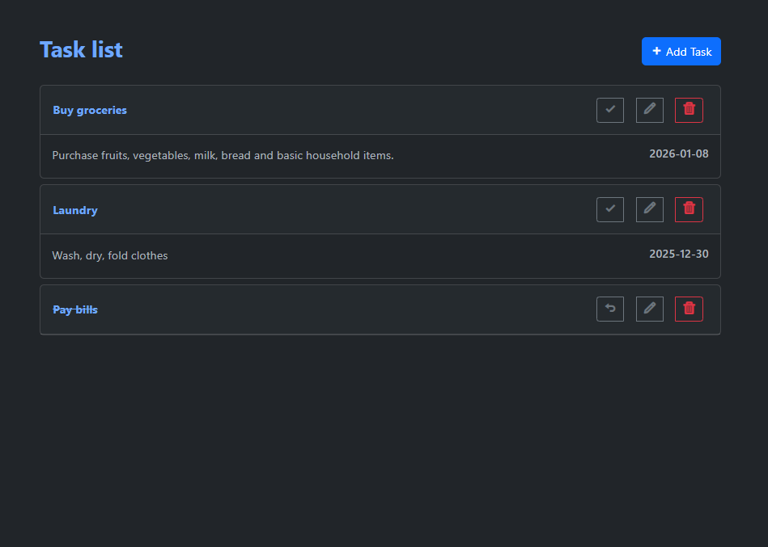

# To Do App: Django & Bootstrap
A simple and clean To Do App with **Django** and **Bootstrap**, allowing users to manage daily tasks.

# Features
- Create tasks
- View tasks
- Delete tasks
- Edit tasks
- Mark as completed
- UI using **Bootstrap**

# Tech Stack
- **Language:** Python
- **Back-end:** Django
- **Front-end:** Bootstrap
- **Database:** SQLite (Default Django DB)

# Installation & Setup
## Clone the repo
    git clone https://github.com/ISMAIL-54/Todo_app.git
    cd todo_app

------------------------------------------------------------
## Run locally without Docker
#### Create virtual environment
```bash
    python -m venv venv
    source venv/bin/activate    (Linux)
    .\venv\scripts\activate     (Windows)
```

#### Install dependencies
```bash
    pip install Django
```

#### Run migrations
```bash
    python manage.py migrate
```

#### Start the server
```bash
    python manage.py runserver
```

## Run with Docker
```bash
    docker build -t todo-django .
    docker run -d -p 8080:8080 todo-django
```

# Application Screenshot

